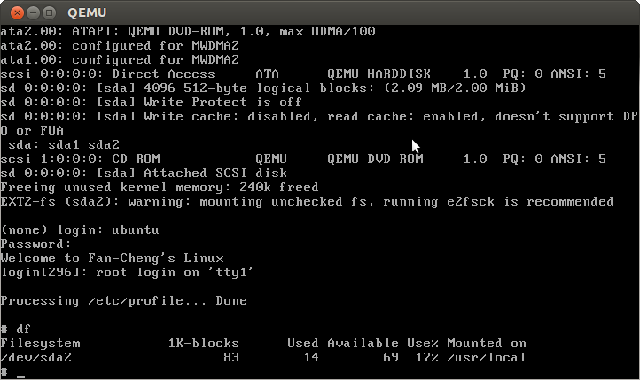

# Screenshot



# Brief Steps

## format and partition

```bash
$ dd if=/dev/zero of=vmhd bs=1M count=2
$ echo "
n
p
1

3900
p
n
p
2


w
" | fdisk -c=dos -C 1024 vmhd
$ fdisk -l vmhd
You must set cylinders.
You can do this from the extra functions menu.

Disk vmhd: 2 MB, 2097152 bytes
255 heads, 63 sectors/track, 0 cylinders, total 4096 sectors
Units = sectors of 1 * 512 = 512 bytes
Sector size (logical/physical): 512 bytes / 512 bytes
I/O size (minimum/optimal): 512 bytes / 512 bytes
Disk identifier: 0xecf5df3b

Device Boot      Start         End      Blocks   Id  System
 vmhd1              63        3900        1919   83  Linux
 vmhd2            3901        4095          97+  83  Linux
$ sudo losetup /dev/loop0 vmhd
$ sudo losetup -o $((512 * 63)) --sizelimit $(((3901 - 63) * 512)) /dev/loop1 vmhd
$ sudo losetup -o $((3901 * 512)) /dev/loop2 vmhd
$ sudo mkfs.ext2 -N 64 -m 0 /dev/loop1
$ sudo mkfs.ext2 -N 64 -m 0 /dev/loop2
$ mkdir mnt mnt2
$ sudo mount /dev/loop1 mnt
$ sudo mount /dev/loop2 mnt2
```

## grub

```bash
$ cd /path/to/grub/code && ./configure && make && sudo make install
$ mkdir -p test/boot/grub
$ # small modify on grub-install in order to install correct device map
$ #     Use when boot-directory is different install device
$ sed 's#^grub_device=.*#grub_device=/dev/loop1#' /usr/local/sbin/grub-install > ./grub-install
$ chmod +x ./grub-install
$ sudo bash -c "cat > test/boot/grub/device.map" <<EOF
(hd0) /dev/loop0
(hd0,1) /dev/loop1
(hd0,2) /dev/loop2
EOF
$ sudo bash -c "cat > test/boot/grub/grub.cfg" <<EOF
set timeout=0
set default=0
set hidden
menuentry "My Linux kernel" {
    set root=(hd0,1)
    linux /boot/vmlinuz
    initrd /boot/initramfs.img
}
EOF
$ sudo ./grub-install --no-floppy --boot-directory=test/boot /dev/loop0
$ # grub may install wrong grub rescue env 'prefix' and wrong root device, so manually setup it
$ #     add -v (verbose) or --debug to debug them
$ sudo /usr/local/sbin/grub-setup --device-map=test/boot/grub/device.map -r \(hd0\) /dev/loop0
$ sudo mkdir -p mnt/boot/grub
$ sudo cp -a test/boot/grub/{bitmap.mod,blocklist.mod,bufio.mod,configfile.mod,ext2.mod,font.mod,grub.cfg,ls.mod,normal.mod,terminal.mod,vga.mod,video_fb.mod,video.mod,bitmap_scale.mod,boot.mod,command.lst,crypto.mod,extcmd.mod,gfxterm.mod,linux.mod,mmap.mod,relocator.mod,vbe.mod,vga_text.mod,videoinfo.mod} mnt/boot/grub/
```

## kernel

```bash
$ cd /path/to/kernel
$ make menuconfig  # deselect all except PCI/PCIE/SATA
$ sudo cp arch/x86/boot/bzImage mnt/boot/
```

## initramfs

```bash
$ mkdir initramfs
$ mkdir initramfs/{lib,proc,sys}
```

### init

```bash
$ cat > initramfs/init <<EOF
#!/bin/sh
init=/sbin/init

mount -t sysfs sysfs /sys
/sbin/mdev -s

exec $init

echo "Impossible here"
exec sh
EOF
$ chmod +x initramfs/init
```

### busybox

```bash
$ cd /path/to/busybox
$ make menuconfig
$ make install
$ cp -ar _install/* /path/to/initramfs
$ # make some busybox downsize, then override busybox. I will talk this latter.
```

### /etc

add user and group

```bash
$ cd /path/to/initramfs
$ cp -r /path/to/busybox/examples/bootfloppy/etc ./
$ cd etc
$ cat group 
ubuntu:x:0:
$ cat etc/passwd
ubuntu:ghAq16L93naao:0:0:root:/root:/bin/ash
$ cat passwd-
ubuntu:x:0:0:root:/root:/bin/ash
$ # use chroot to initramfs to change password
```

mount second partition at startup and enable login service

```bash
$ cat fstab 
proc		/proc	proc	defaults    0	0
sysfs   /sys  sysfs   defaults 0   0
/dev/sda2   /usr/local  ext2   defaults 0   0
$ mkdir path/to/initramfs/usr/local
$ cat inittab 
::sysinit:/bin/mount -a
tty1::respawn:/sbin/getty 38400 tty1
::ctrlaltdel:/bin/umount -a -r
```

welcome message

```bash
$ cat motd 
Welcome to Fan-Cheng's Linux
```

### create initramfs.img

```bash
$ cd ..
$ find ./ | cpio -o -H newc | gzip > ../initramfs.img
$ sudo cp ../initramfs.img ../mnt/boot/
```

## try out

```bash
$ sudo qemu-system-x86_64 -hda vmhd
```

# Requirements

## Downsize

### grub (final size: 293 Kbytes + 63 sectors)

remove unused mod

### Kernel (final size: 999024 bytes)

deselect all options except PCI/PCIE/SATA.

### initramfs (final size: 583504 bytes)

busybox

1. deselect most of busybox options
2. link(gcc) library for busybox as static one
3. relink it with uClibc libm.a and libcrypt.a

### disk

1. Set rootfs as ramdisk
2. mount the partitions which will change after booting, such as /home.
3. Specify inode number and donot reserve space for super user.

## disk partition

Refer [brief steps](#format-and-partition) for detailed steps

1. losetup should be specify sizelimit
2. In device.map of grub, add corresponding one
3. mount it at /etc/fstab

## login

Add following line in /etc/inittab

```bash
tty1::respawn:/sbin/getty 38400 tty1
```

## welcome message

Add a file called /etc/motd. The file will be print after loging by getty in busybox

